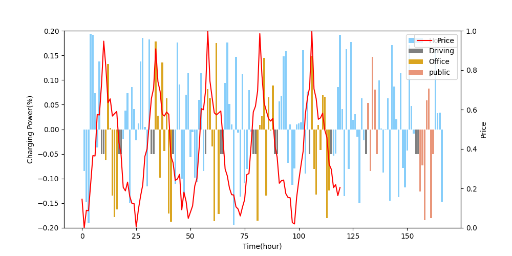

# Deep Reinforcement Learning for Continuous Electric Vehicles Charging Control With Dynamic User Behaviors

<div align="center">
  <p> English| <a href="./README_zh.md">中文</a>
  </p>
</div>

This repository provides **unofficial** PyTorch code for implementing the methods described in the paper "[Deep Reinforcement Learning for Continuous Electric Vehicles Charging Control With Dynamic User Behaviors](https://ieeexplore.ieee.org/abstract/document/9493711)". We rename is as `Anxious EV Charging`.

The original paper's author did not release open-source code, so this repository aims to provide a simplified version of the methods presented in the paper. Our implementation is designed to achieve similar results to the original paper, making it a valuable resource for those interested in reproducing the results.

If your goal is to reproduce the results presented in the original paper, you can rely on our code as a reference. We have strived to achieve similar results, making this repository a valuable resource for research and validation purposes.

## Key Features

- Unofficial PyTorch implementation
- Reproduces results from the original paper
- Simplified codebase for easier understanding
- Charging and discharging control of electric vehicles (V2G/G2V)
- Continuous Electric Vehicles Charging Control
- Handles Dynamic User Behaviors
- **In order to simplify, the SL network in the paper has been deleted. So the code is only based on Soft Actor-critic (SAC)**. Nevertheless, the algorithm still performs well

## Getting Started

To get started with our code, follow these steps: 

1. Clone this repository to your local machine:

```shell
git clone https://github.com/meditateultra/anxious-EV-charging
```

2. Install the required dependencies:

```shell
pip install -r requirements.txt
```

3. Start the training:

```shell
python main.py [--cuda] [--save_path="run/one"]
```

4. Open `tensorboard `to visualize the training process:

```shell
tensorboard --logdir=run/one/ 
```


If you aim to verify the effectiveness, you can execute the following command:

```shell
python main.py --simulate [--policy_path="example/policy.pb"] [--save_path="run/one"]
```

`--policy_path="example/policy.pb"` is our trained model, and you can also replace it with your own trained model.

## Reproducing Results


We simulate a charging/discharging progress in a week. The user's travel habits were simulated based on the paper.



## Star this Repository

If you find this repository helpful, please consider giving it a star. Your support is crucial to us and motivates us to continue improving and maintaining this project.

Thank you for your interest in our work!

------

**Disclaimer:** This repository is not affiliated with the authors of the original paper and is intended for research and educational purposes.
