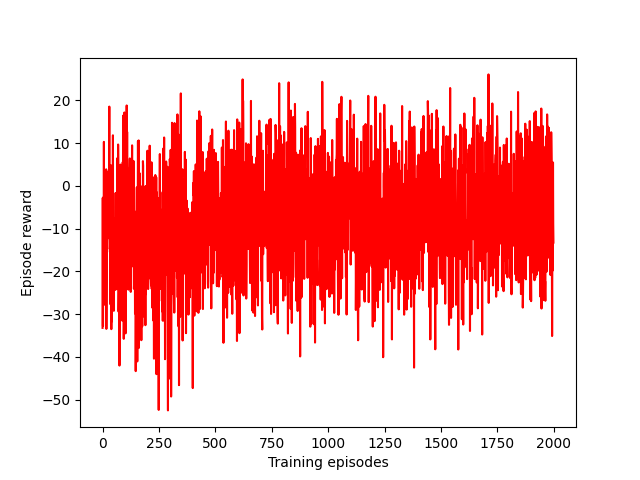

# Deep Reinforcement Learning for Continuous Electric Vehicles Charging Control With Dynamic User Behaviors

<div align="center">
  <p> 中文| <a href="./README.md">English</a>
  </p>
</div>

该仓库为论文"[Deep Reinforcement Learning for Continuous Electric Vehicles Charging Control With Dynamic User Behaviors](https://ieeexplore.ieee.org/abstract/document/9493711)"的**非官方**实现。我们将其命名为“Anxious EV Charging”。

原始论文的作者没有发布开源代码，因此该存储库旨在提供论文中提出的方法的简化版本。我们的实现旨在实现与原始论文类似的结果，使其成为那些有兴趣复现结果的人的宝贵资源。

如果你的目标是重现原始论文中的结果，你可以参考我们的代码。我们努力实现类似的结果，使该存储库成为研究和验证目的的宝贵资源。

## 主要特点

- PyTorch的非官方实施
- 复制原始论文的结果
- 简化了代码库，便于理解
- 电动汽车充放电控制（V2G/G2V）
- 电动汽车连续充电控制
- 处理动态用户行为
- **为了简化，删除了文中的SL网络。因此，该代码仅基于Soft Actor critic（SAC）**。尽管如此，该算法仍然表现良好

## 快速开始

要开始使用我们的代码，请执行以下步骤：

1. 将此仓库克隆到本地计算机：

```shell
git clone https://github.com/meditateultra/anxious-EV-charging
```

2. 安装需要的依赖：

```shell
pip install -r requirements.txt
```

3. 开始训练：

```shell
python main.py [--cuda] [--save_path="run/one"]
```

4. 打开 `tensorboard `可视化训练过程：

```shell
tensorboard --logdir=run/one/ 
```


如果您打算验证效果，您可以执行以下命令：

```shell
python main.py --simulate [--policy_path="example/policy.pb"] [--save_path="run/one"]
```

`--policy_path="example/policy.pb"` 是我们训练好的模型, 你也可以使用自己的模型代替它.

## 复现结果




我们模拟一周内的充电/放电过程。根据论文模拟了用户的旅行习惯。


## 给仓库star

如果您觉得这个仓库很有用，请考虑给它star。您的支持对我们至关重要，并激励我们继续改进和维护此项目。

感谢您对我们工作的关注！

------

**免责声明：** 此仓库与原始论文的作者无关，用于研究和教育目的。
